# Estimating Uncertainty in the Mean of Unsteady CFD Signals

## Abstract
In unsteady CFD simulations, reported quantities such as \(C_d\) and \(C_l\) are computed as means of finite-length fluctuating signals. The resulting statistical uncertainty in the mean is often large enough to affect design decisions, particularly when geometry-to-geometry deltas are small. This repository evaluates practical methods for estimating uncertainty in the mean of these signals, building on work by Norman and Howard [8].

The analysis uses synthetic signals with known behavior and a mixed-spectrum signal representative of real CFD time histories. We focus on four methods: batch means (BM), overlapping batch means (OBM), an autocovariance-integral method (ACC), and a tail-fit extrapolation method (Tail). 

## Introduction
For a time sequence \(x_i\), the sample mean is
\[
\mu = \frac{1}{N}\sum_{i=1}^{N} x_i. \tag{1}
\]
If samples were independent, the variance in the mean would be
\[
\mathrm{Var}(\mu) = \frac{\sigma^2}{N}. \tag{2}
\]
In unsteady CFD, however, adjacent samples are strongly correlated because the time step is small relative to dominant flow timescales. As a result, Equation (2) underpredicts the true uncertainty, often substantially. This is often characterized by using an effective number of samples, as discussed further in [8].

### Figure 1 — Signal and running mean
Figure 1 shows an unsteady signal the cumulative forward average.
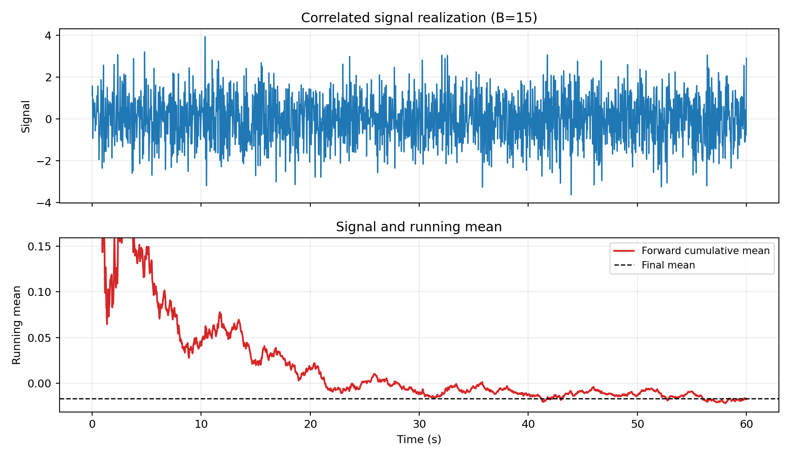
Code: [`workflows/figure_01_signal_running_mean.py`](../workflows/figure_01_signal_running_mean.py)

### Figure 2 — Band-limited reference PSD
We are generating this signal with a band-limited PSD, shown here. This provides a controlled analytic baseline for testing uncertainty estimators. All the signals generated here are 100 seconds in length, with a dt=2E-4, minimicking a CFD simulation.
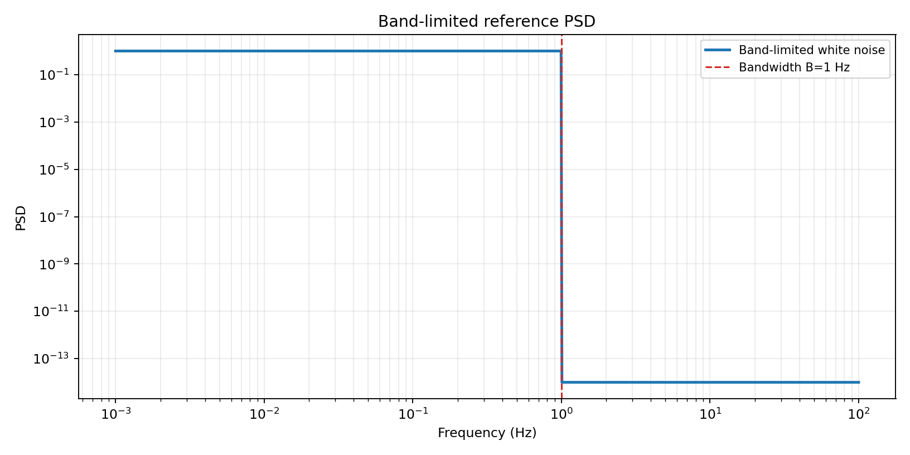
Code: [`workflows/figure_02_bl_psd.py`](../workflows/figure_02_bl_psd.py)

## Analytic Baseline: Band-Limited Noise
For bandwidth-limited (BL) noise with bandwidth \(B\) (as described by Bendat and Piersol [4] and utilized by Mockett et al. [2]), the normalized variance of the mean has closed form:
\[
\mathrm{Var}_{\mathrm{BL}}(t,B)=
\frac{-\sin^2(\pi Bt)+\pi Bt\,\mathrm{Si}(2\pi Bt)}{(\pi Bt)^2}. \tag{3}
\]

As shown in Figure 3, at long times this follows \(t^{-1/2}\) scaling, which is the key trend used by several estimators.

### Figure 3 — Analytic BL uncertainty scaling
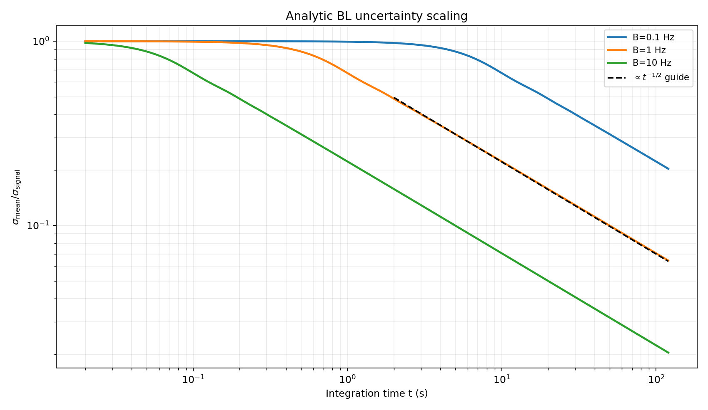
Code: [`workflows/figure_03_bl_uncertainty_scaling.py`](../workflows/figure_03_bl_uncertainty_scaling.py)

Signals generated out of this power spectrum are shown below. At 5 seconds, the signal with B = 0.1 is not fully resolved -- we have not seen even an entire cycle of a low freqency mode. Signals like the above can be added to generate more realistic signals with a mixture of high and low frequency noise.

### Figure 3B — Raw BL signals across B (5 s)
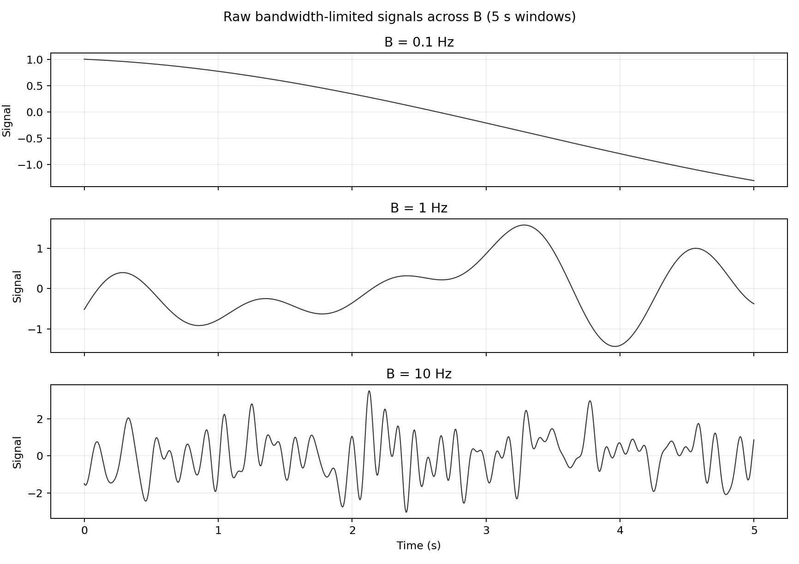
Code: [`workflows/figure_03b_raw_bl_signals.py`](../workflows/figure_03b_raw_bl_signals.py)

## Batch-Means Methods
### Batch Means (BM)
This method works as follows: for batch length \(b\), split the signal into non-overlapping windows, compute batch means, then estimate variance of those means. Then, across a set of batch lengths, fit trend in the variance of the batch means to predict variance at full signal length.

### Figure 4 — Batch-means intuition
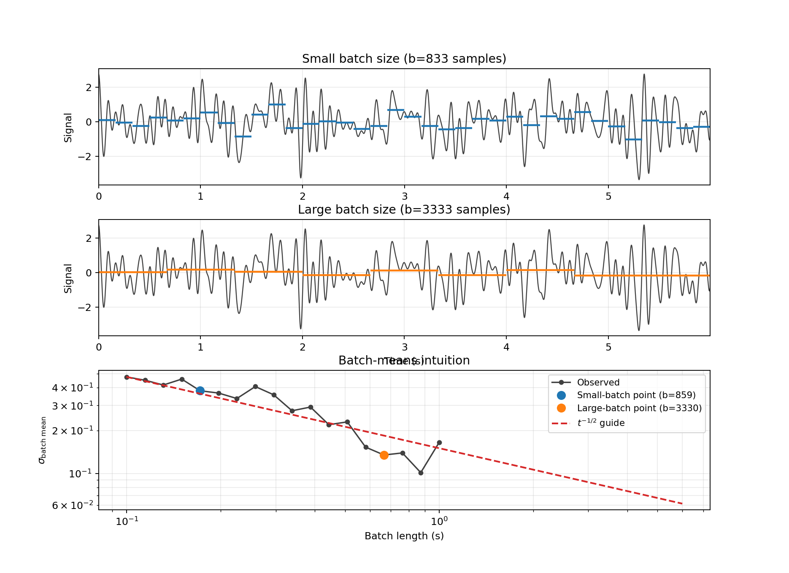
Code: [`workflows/figure_04_bm_intuition.py`](../workflows/figure_04_bm_intuition.py)

### Overlapping Batch Means (OBM)
OBM uses overlapping windows instead of adjacent ones. This increases the number of batch means for each \(b\), reducing estimator noise while keeping the same underlying model.

### Figure 5 — OBM overlap concept
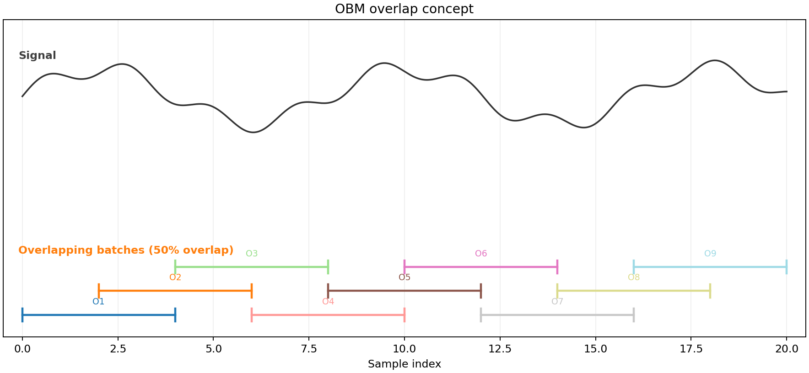
Code: [`workflows/figure_05_obm_overlap_diagram.py`](../workflows/figure_05_obm_overlap_diagram.py)

Figures 6 and 7 show the performance of these methods at different values of B. Overlapping batch means does a better ob at higher values once all lower frequency modes are resolved, while batch means does a better job at lower times/B when not all frequncies are resolved.

### Figure 6 — OBM overlap sweep (10%, 25%, 50%, 75%, 99%) vs BM across regimes
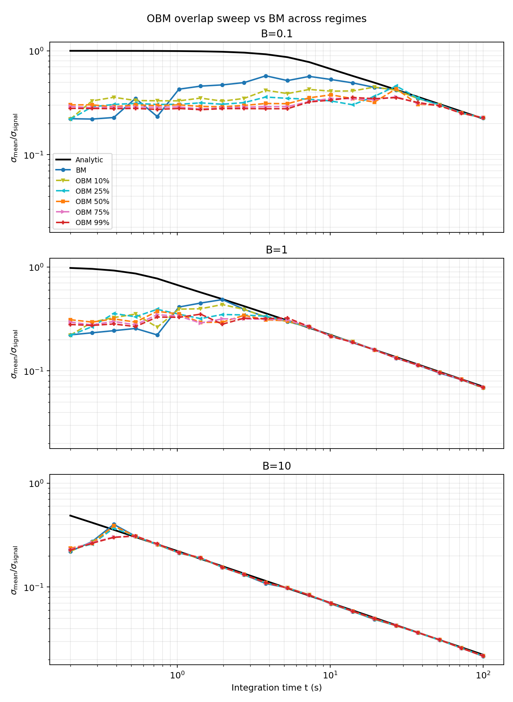
Code: [`workflows/figure_06_obm_vs_bm_regimes.py`](../workflows/figure_06_obm_vs_bm_regimes.py)

### Figure 7 — OBM overlap sweep MAE vs B
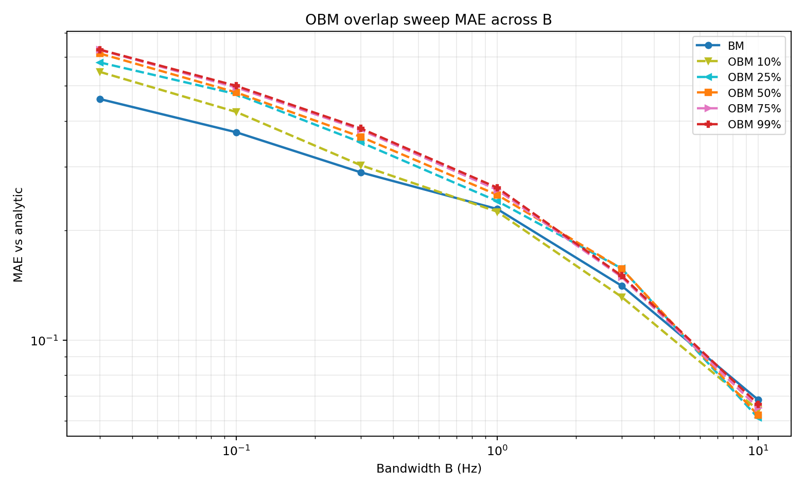
Code: [`workflows/figure_07_obm_vs_bm_mae.py`](../workflows/figure_07_obm_vs_bm_mae.py)

## Autocovariance-Integral Method (ACC)
The variance in the mean can also be computed using the integral of the autocorrleation function:
\[
\mathrm{Var}(\mu)\approx
\frac{2}{T}\int_{0}^{T}\left(1-\frac{\tau}{T}\right)C_{xx}(\tau)\,d\tau. \tag{5}
\]
The  autocovariance function is calculated through:
\[
C_{xx}(\tau)=\frac{1}{T-\tau}\int_0^{T-\tau}(x(t)-\mu)(x(t+\tau)-\mu)\,dt. \tag{6}
\]

One challege with this is that \C_{xx}(\tau)\ becombes increasingly noisy at as time increases. To address this, we look at two strategies:

(1) Integration is truncated at the first zero crossing of \(C_{xx}(\tau)\) 

For bandwidth-limited noise, this first-zero truncation has a closed-form asymptotic bias. With
\[
C(\tau)=\sigma^2\frac{\sin(2\pi B\tau)}{2\pi B\tau},
\]
truncating at \(\tau_0=1/(2B)\) gives
\[
\frac{\mathrm{Var}_{\mathrm{ACC,zero}}}{\mathrm{Var}_{\mathrm{true}}}
\xrightarrow[T\to\infty]{}
\frac{2\,\mathrm{Si}(\pi)}{\pi}\approx 1.17898. \tag{7}
\]
So the ACC-zero variance estimate is scaled by the inverse factor,
\[
\mathrm{Var}_{\mathrm{ACC,zero,corr}}
=\frac{\pi}{2\,\mathrm{Si}(\pi)}\,
\mathrm{Var}_{\mathrm{ACC,zero}}
\approx 0.8482\,\mathrm{Var}_{\mathrm{ACC,zero}}. \tag{8}
\]
In standard-deviation form this is a factor of \(\sqrt{\pi/(2\mathrm{Si}(\pi))}\approx 0.921\).

(2) Following the Heidelberger and Welch [5] style biasing idea used in the paper context [8], we also evaluate a tail-damped ACC variant:
\[
C_{xx}^{\mathrm{damped}}(\tau)=\left(1-\frac{\tau}{T}\right)C_{xx}(\tau), \tag{9}
\]
then integrate across lags using the damped sequence.

Figure 8 shows how these methods effectively treat the autocorrelation function.

### Figure 8 — ACC weighted-integral view
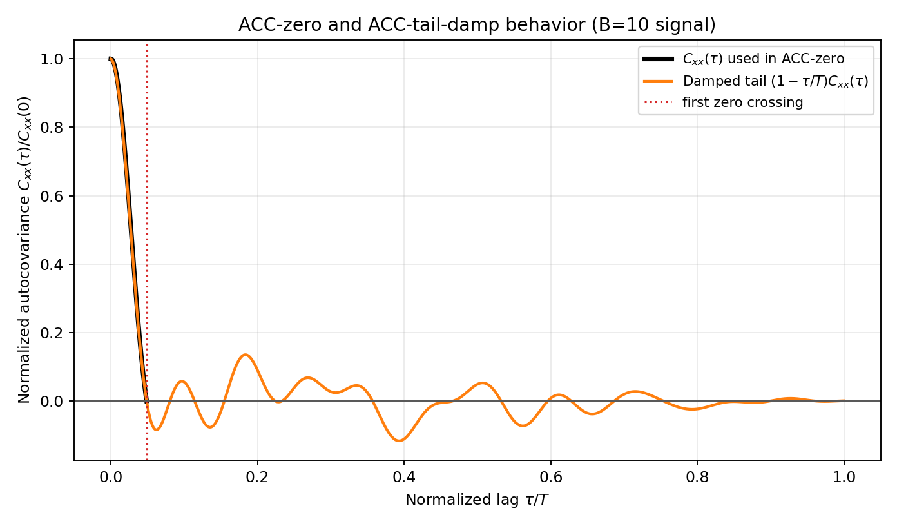
Code: [`workflows/figure_08_acc_theory.py`](../workflows/figure_08_acc_theory.py)

Figure 9 shows the performances of the methods. The uncorrected zero crossing methhod shows consistent bias at higher times, where as the zero crossing correction converges to the analytic value. The tail damping method consistently underpredicts the analalytic values at later times.

### Figure 9 — ACC variant comparison at \(B=1\)
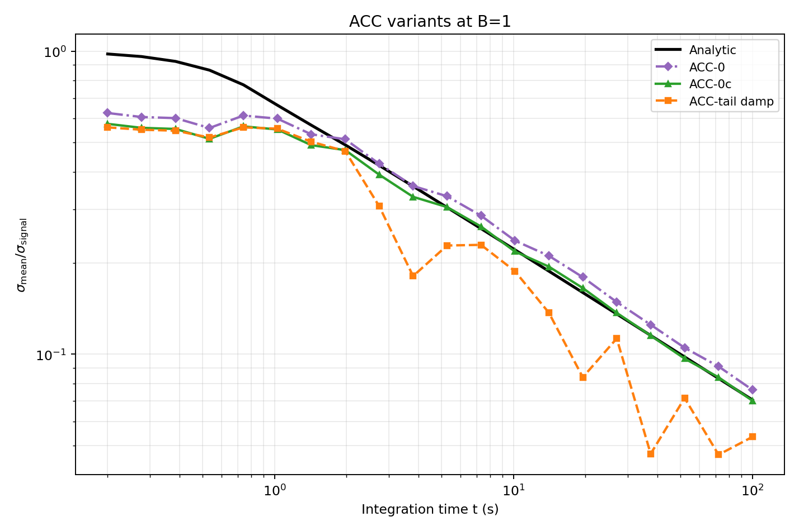
Code: [`workflows/figure_09_acc_variants_single_B.py`](../workflows/figure_09_acc_variants_single_B.py)

### Figure 10 — ACC variant MAE across \(B\)
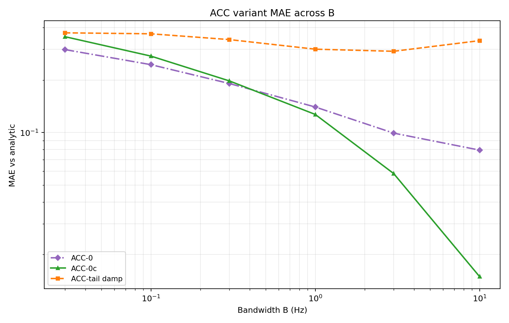
Code: [`workflows/figure_10_acc_variants_mae_vs_B.py`](../workflows/figure_10_acc_variants_mae_vs_B.py)

## Tail-Fit Method
The Tail method fits the late-time BM trend in log-log space, then extrapolates to full signal length. The fitted slope is constrained to physically plausible decay behavior and guarded against unstable fits.

As shown in Figures 12 and 13 this method does well accross most regimes, but under-predicts the analytic value in some places.

### Figure 11 — Tail-fit concept
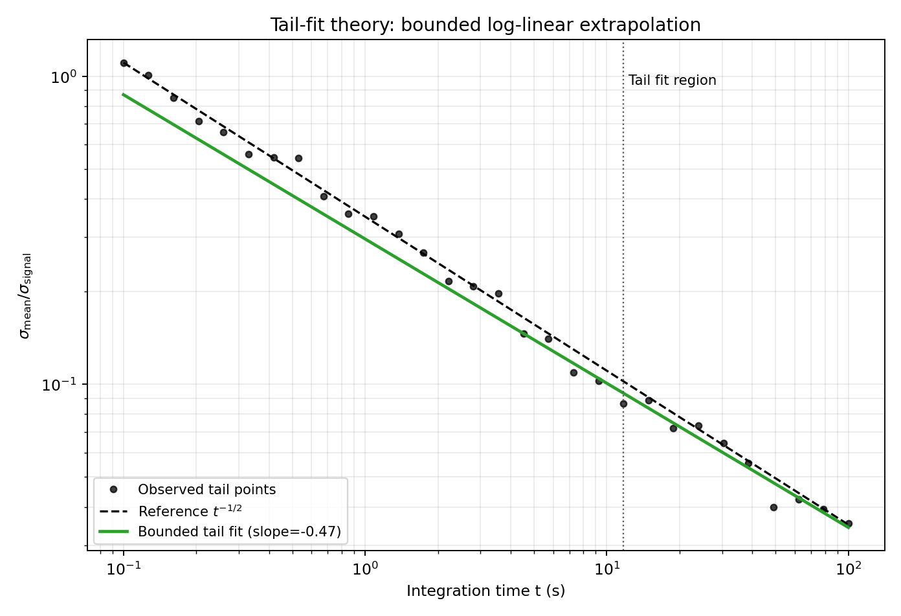
Code: [`workflows/figure_11_tail_theory.py`](../workflows/figure_11_tail_theory.py)

### Figure 12 — Tail vs BM across regimes
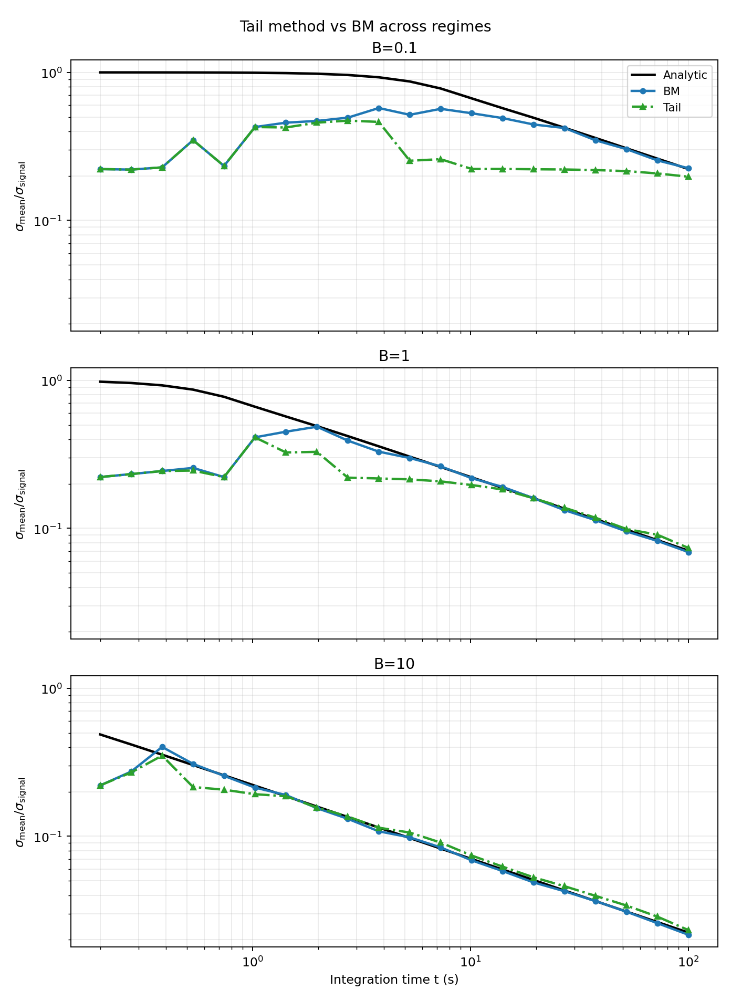
Code: [`workflows/figure_12_tail_vs_bm_regimes.py`](../workflows/figure_12_tail_vs_bm_regimes.py)

### Figure 13 — Tail vs BM MAE across B

Code: [`workflows/figure_13_tail_vs_bm_mae.py`](../workflows/figure_13_tail_vs_bm_mae.py)

## Comparative Performance on BL Signals
The next figures compare BM, OBM (75%), ACC-0c, and Tail. For these signals, the Acc-0c method does the best overall, at early and later times!

### Figure 14 — Regime snapshots (BM, OBM 75%, ACC-0c, Tail)

Code: [`workflows/figure_14_methods_regimes.py`](../workflows/figure_14_methods_regimes.py)

### Figure 15 — MAE across B (BM, OBM 75%, ACC-0c, Tail)

Code: [`workflows/figure_15_methods_mae_vs_B.py`](../workflows/figure_15_methods_mae_vs_B.py)

## Evaluation on a Real-World-Style Spectrum
To simulate are more realistic signal from a CFD simulation, we evaluate a spectrum with low-frequency plateau and high-frequency \(f^{-5/3}\) decay. Monte Carlo sampling provides a target uncertainty trend for comparison.

### Figure 16 — Piecewise-spectrum signal diagnostics
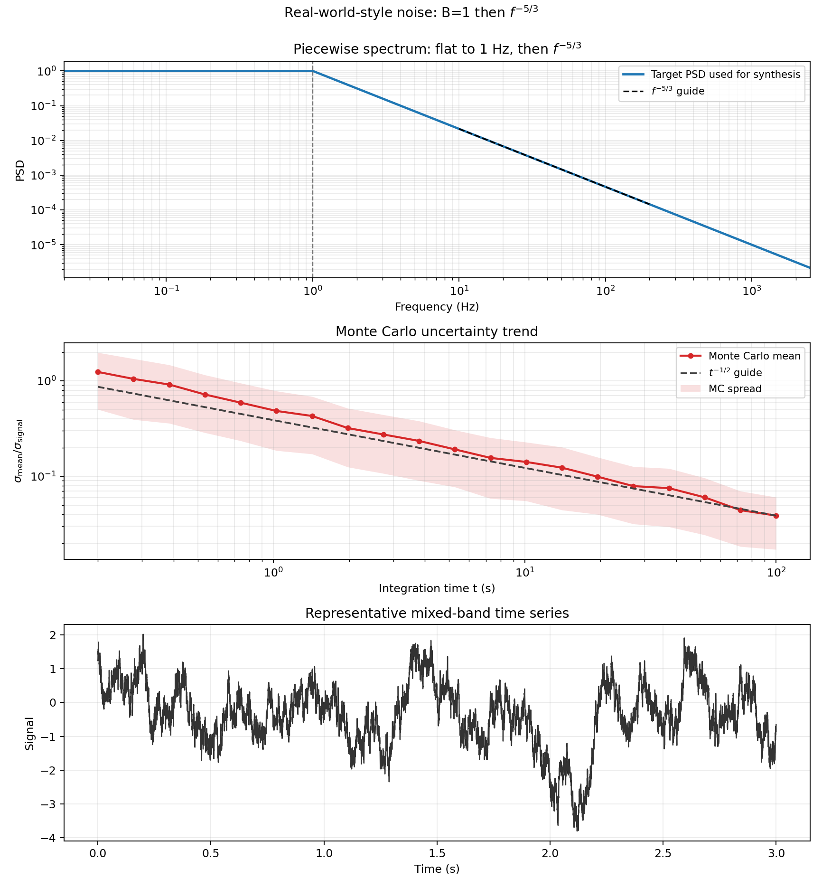
Code: [`workflows/figure_16_realworld_noise.py`](../workflows/figure_16_realworld_noise.py)

Figure 17 and 18 show more mixed results than on the simple bandlimited white noise signals, although again the ACC-0c method slightly outperforms the other methods.

### Figure 17 — Method comparison on piecewise-spectrum signal (BM, OBM 75%, ACC-0c, Tail)
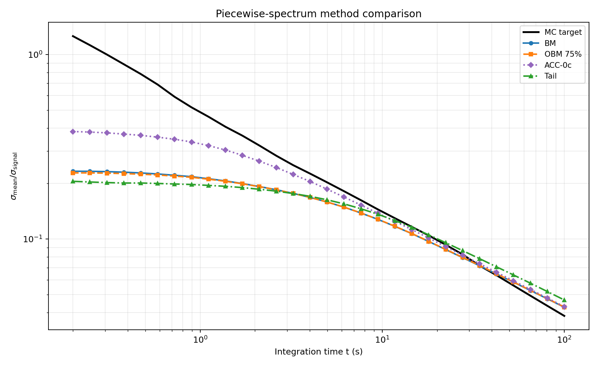
Code: [`workflows/figure_17_18_realworld_combined.py`](../workflows/figure_17_18_realworld_combined.py)

### Figure 18 — MAE vs integration time on piecewise-spectrum signal
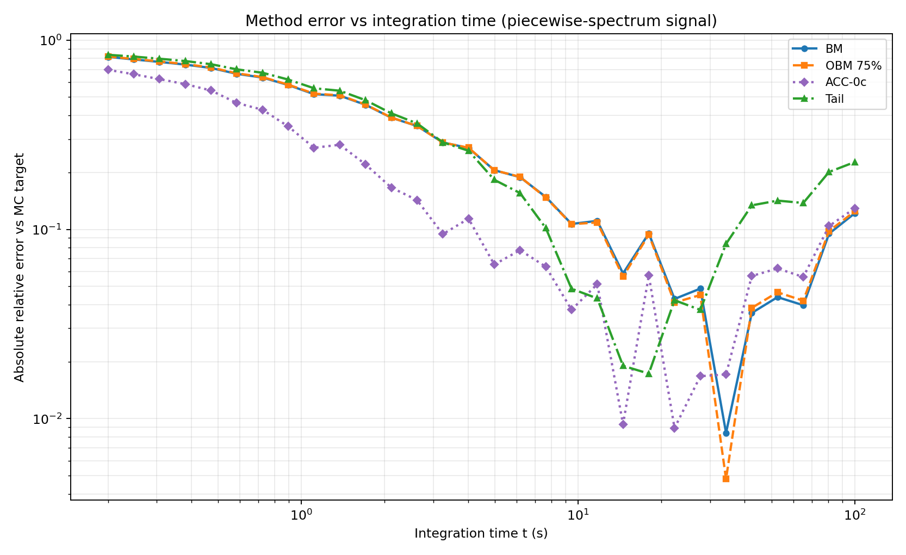
Code: [`workflows/figure_17_18_realworld_combined.py`](../workflows/figure_17_18_realworld_combined.py)

## Stationarity Detection (Mockett-Style)
To identify initial non-stationarity, a typical practice (like the methods evaluated in [8] and developed by Mockett et al. [2]) is to remove increasing amounts of early-time data and recompute uncertainty \(s\) each time. For this synthetic test, the baseline signal uses a piecewise spectrum (flat to 10 Hz, then \(f^{-5/3}\)), with an added exponential transient of amplitude \(2\sigma\) from \(t=0\). The transient is shifted so the 90% cutoff at \(t=1\) s is continuous (no step jump at cutoff).

Using ACC-0c to estimate uncertainty in the mean for each trimmed signal, the curve \(s(t_{\mathrm{remove}})\) shows a minimum near the end of the transient. The minimum is used as the detected transient-removal time. This approach can be compared against other techniques such as the Geweke [7] z-score test or Heidelberger and Welch Cramer-von-Mises test [5], which also evaluate stationarity.

### Figure 19 — Mockett-style stationarity scan with ACC-0c

Code: [`workflows/figure_19_stationarity_mockett.py`](../workflows/figure_19_stationarity_mockett.py)

### Figure 20 — Two-panel distributions: detected stabilization time and mean bias (1σ, 2σ, 3σ transients)
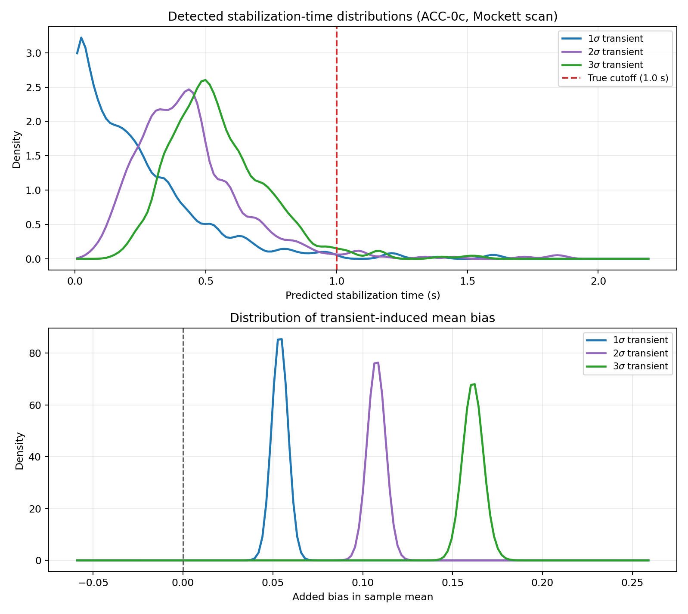
Code: [`workflows/figure_20_stationarity_distribution.py`](../workflows/figure_20_stationarity_distribution.py)

## References
[1] P. Bevington and K. Robinson, *Data Reduction and Error Analysis in the Physical Sciences*, McGraw-Hill, 1993.

[2] C. Mockett, T. Knacke, and F. Thiele, “Detection of Initial Transients and Estimation of Statistical Error in Time-Resolved Turbulent Flow Data,” 2010.

[3] H. Flyvbjerg and H. G. Petersen, “Error estimates on averages of correlated data,” *J. Chem. Phys.*, 1989.

[4] J. S. Bendat and A. G. Piersol, *Random Data: Analysis and Measurement Procedures*, Wiley, 2010.

[5] P. Heidelberger and P. D. Welch, “A spectral method for confidence interval generation and run length control in simulations,” 1981.

[6] A. D. Sokal, “Monte Carlo Methods in Statistical Mechanics: Foundations and New Algorithms,” 1996.

[7] J. Geweke, “Evaluating the accuracy of sampling-based approaches to calculating posterior moments,” 1991.

[8] P. Norman and K. Howard, “Evaluating Statistical Error in Unsteady Automotive Computational Fluid Dynamics Simulations,” SAE Technical Paper 2020-01-0692, 2020.
