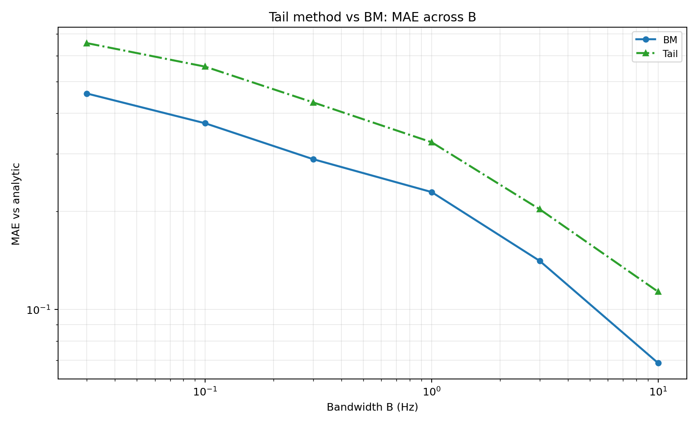
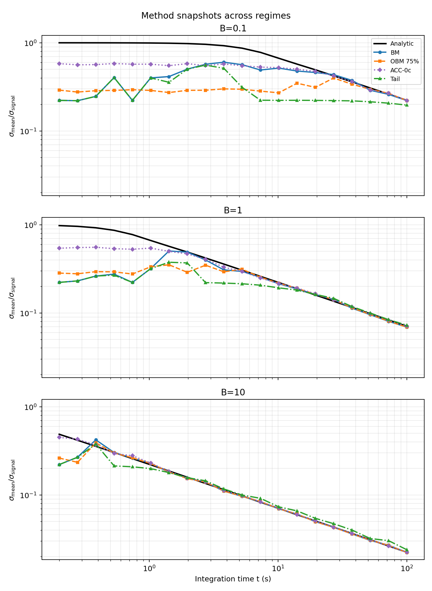
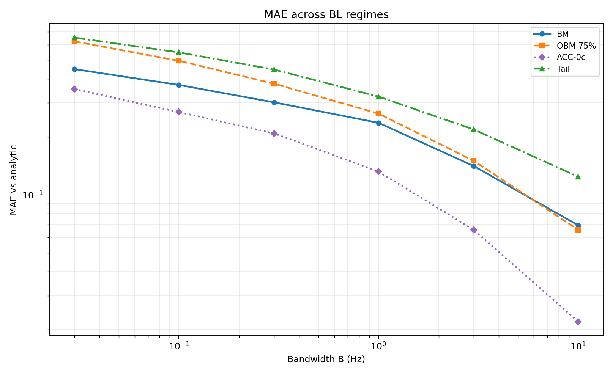
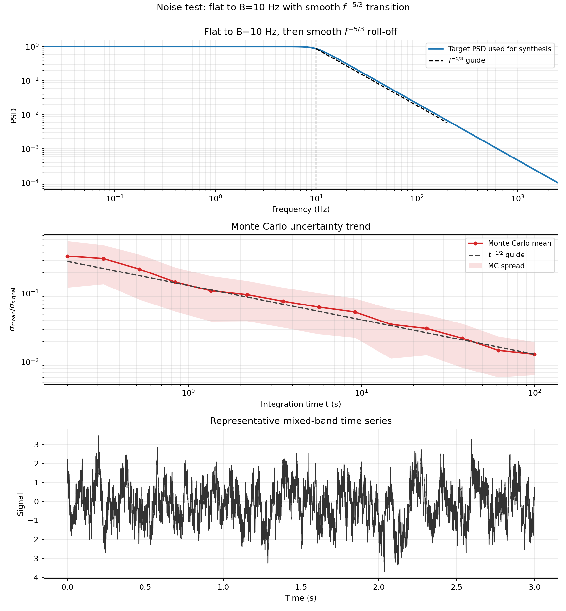
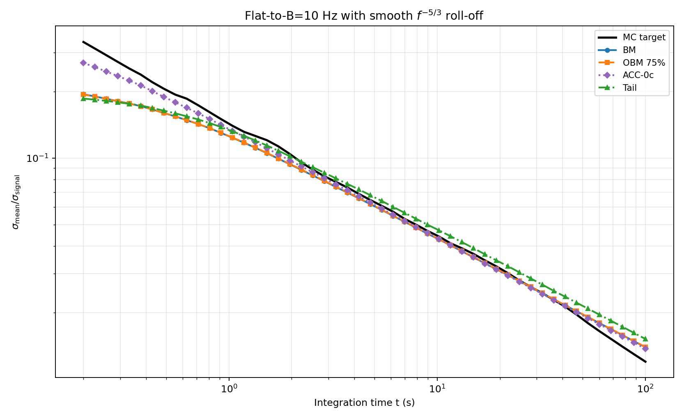
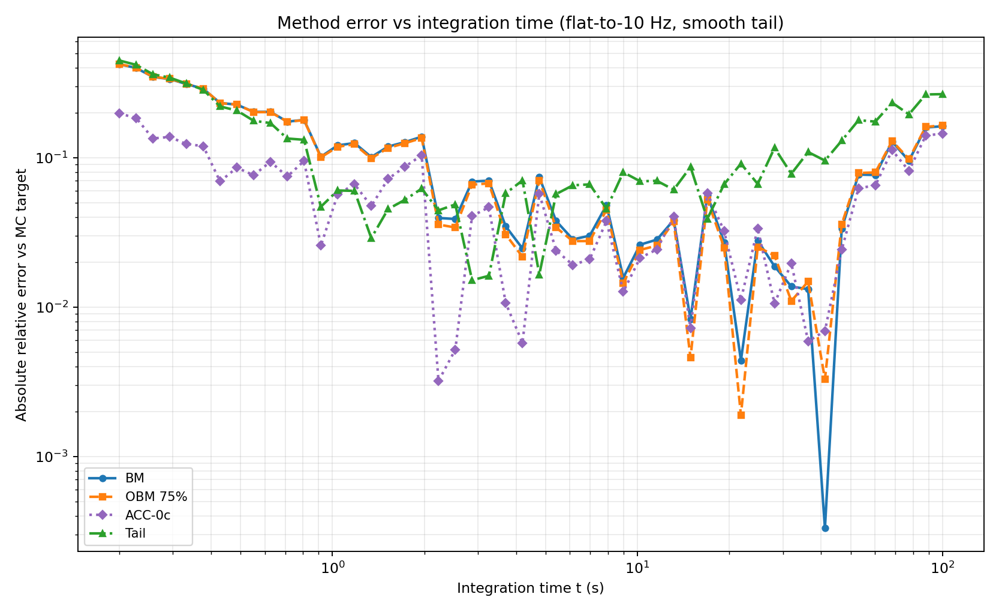
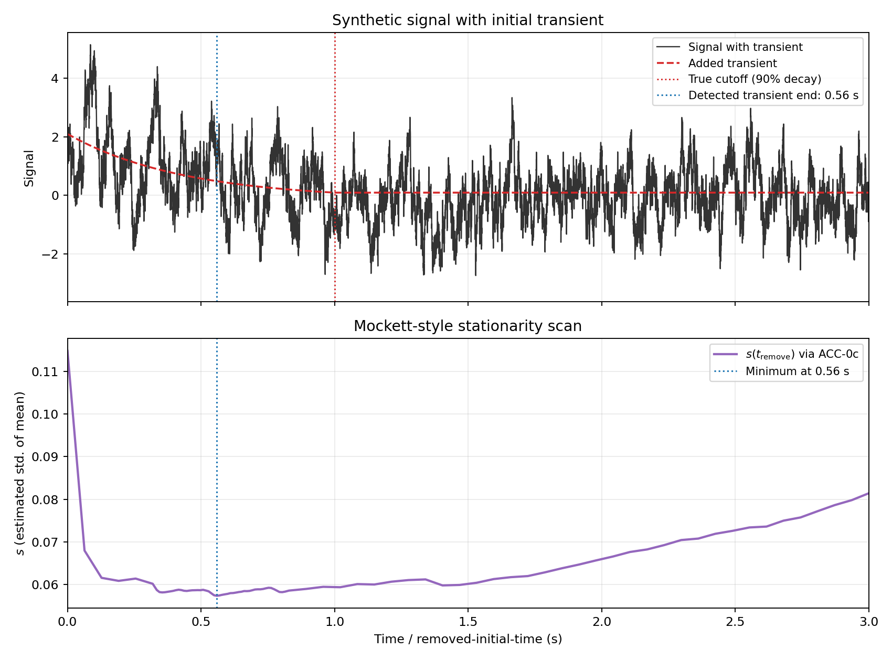
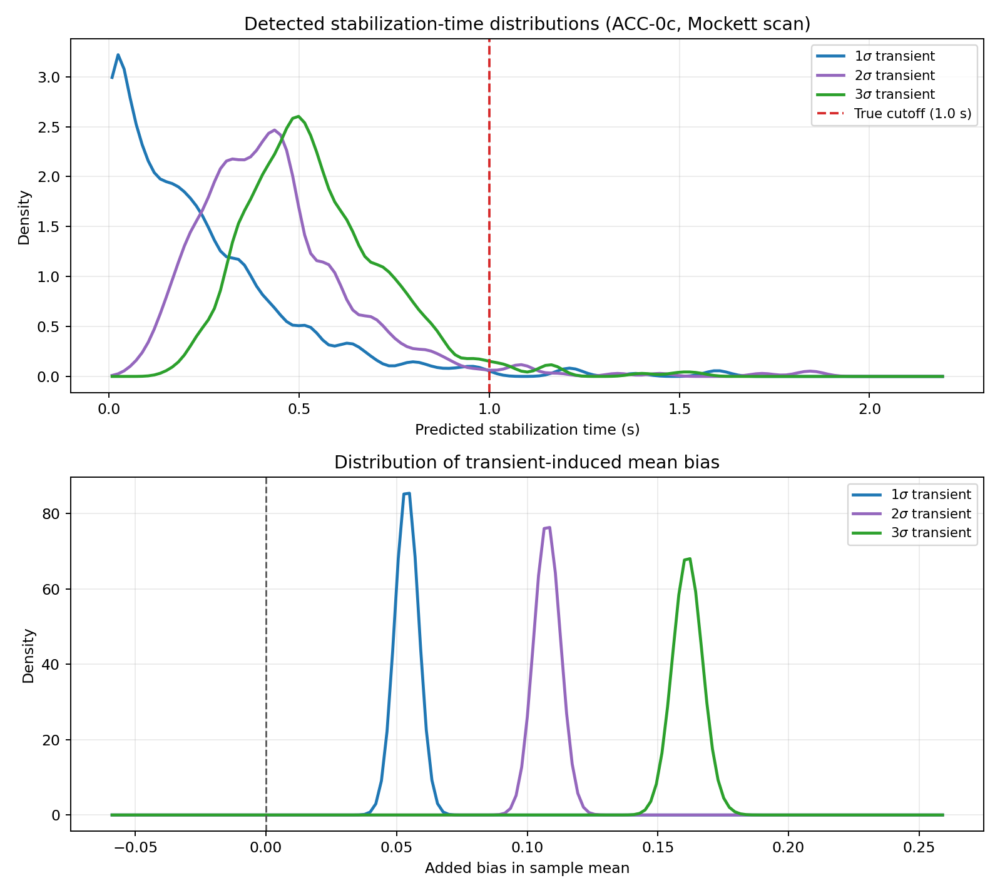

# Estimating Uncertainty in the Mean of Unsteady CFD Signals

## Abstract
In unsteady automotive CFD, reported quantities such as \(C_d\) and \(C_l\) are computed as means of finite-length fluctuating signals. The resulting statistical uncertainty in the mean is often large enough to affect design decisions, particularly when geometry-to-geometry deltas are small. This repository evaluates practical methods for estimating uncertainty in the mean for correlated signals, with emphasis on methods that are robust, interpretable, and usable in production CFD workflows.

The analysis uses synthetic signals with known behavior and a mixed-spectrum signal representative of real CFD time histories. We focus on four methods: batch means (BM), overlapping batch means (OBM), an autocovariance-integral method (ACC), and a tail-fit extrapolation method (Tail). Results are presented in terms of normalized uncertainty,
\[
\frac{\sigma_{\mathrm{mean}}}{\sigma_{\mathrm{signal}}},
\]
across under-resolved, resolved, and over-resolved regimes.

## Introduction
For a time sequence \(x_i\), the sample mean is
\[
\mu = \frac{1}{N}\sum_{i=1}^{N} x_i. \tag{1}
\]
If samples were independent, the variance in the mean would be
\[
\mathrm{Var}(\mu) = \frac{\sigma^2}{N}. \tag{2}
\]
In unsteady CFD, however, adjacent samples are strongly correlated because the time step is small relative to dominant flow timescales. As a result, Equation (2) underpredicts the true uncertainty, often substantially.

This repository studies practical estimators for correlated signals. The objective is not exhaustive statistical theory, but a CFD-oriented workflow that gives reliable uncertainty trends and useful real-time guidance on run length.

### Figure 1 — Signal and running mean

Code: [`workflows/figure_01_signal_running_mean.py`](../workflows/figure_01_signal_running_mean.py)

### Figure 2 — Band-limited reference PSD

Code: [`workflows/figure_02_bl_psd.py`](../workflows/figure_02_bl_psd.py)

## Analytic Baseline: Band-Limited Noise
For one-sided bandwidth-limited (BL) noise with bandwidth \(B\), the normalized variance of the mean has closed form:
\[
\mathrm{Var}_{\mathrm{BL}}(t,B)=
\frac{-\sin^2(\pi Bt)+\pi Bt\,\mathrm{Si}(2\pi Bt)}{(\pi Bt)^2}. \tag{3}
\]
We report normalized standard deviation:
\[
\frac{\sigma_{\mathrm{mean}}}{\sigma_{\mathrm{signal}}}
= \sqrt{\mathrm{Var}_{\mathrm{BL}}(t,B)}. \tag{4}
\]
At long times this follows \(t^{-1/2}\) scaling, which is the key trend used by several estimators.

### Figure 3 — Analytic BL uncertainty scaling

Code: [`workflows/figure_03_bl_uncertainty_scaling.py`](../workflows/figure_03_bl_uncertainty_scaling.py)

## Batch-Means Family
### Batch Means (BM)
For batch length \(b\), split the signal into non-overlapping windows, compute batch means, then estimate variance of those means. Across a set of batch lengths, fit the BL form to infer effective bandwidth and predict variance at full signal length.

### Overlapping Batch Means (OBM)
OBM uses overlapping windows instead of disjoint windows. This increases the number of batch means for each \(b\), reducing estimator noise while keeping the same underlying model.

### Figure 4 — Batch-means intuition

Code: [`workflows/figure_04_bm_intuition.py`](../workflows/figure_04_bm_intuition.py)

### Figure 5 — OBM overlap concept

Code: [`workflows/figure_05_obm_overlap_diagram.py`](../workflows/figure_05_obm_overlap_diagram.py)

### Figure 6 — OBM overlap sweep (10%, 25%, 50%, 75%, 99%) vs BM across regimes

Code: [`workflows/figure_05b_obm_vs_bm_regimes.py`](../workflows/figure_05b_obm_vs_bm_regimes.py)

### Figure 7 — OBM overlap sweep MAE vs B

Code: [`workflows/figure_05c_obm_vs_bm_mae.py`](../workflows/figure_05c_obm_vs_bm_mae.py)

## Autocovariance-Integral Method (ACC)
The ACC estimate is written in continuous-time form as:
\[
\mathrm{Var}(\mu)\approx
\frac{2}{T}\int_{0}^{T}\left(1-\frac{\tau}{T}\right)C_{xx}(\tau)\,d\tau. \tag{5}
\]
Implementation details used here:
- \(C_{xx}(\tau)\) is computed with an FFT-based autocovariance routine.
- The finite-record autocovariance is evaluated in integral form as:
\[
C_{xx}(\tau)=\frac{1}{T-\tau}\int_0^{T-\tau}(x(t)-\mu)(x(t+\tau)-\mu)\,dt. \tag{6}
\]
- Integration is truncated at the first zero crossing of \(C_{xx}(\tau)\) to avoid noise-dominated tail contributions.

For bandwidth-limited noise, this first-zero truncation has a closed-form asymptotic bias. With
\[
C(\tau)=\sigma^2\frac{\sin(2\pi B\tau)}{2\pi B\tau},
\]
truncating at \(\tau_0=1/(2B)\) gives
\[
\frac{\mathrm{Var}_{\mathrm{ACC,zero}}}{\mathrm{Var}_{\mathrm{true}}}
\xrightarrow[T\to\infty]{}
\frac{2\,\mathrm{Si}(\pi)}{\pi}\approx 1.17898. \tag{7}
\]
So the ACC-zero variance estimate is scaled by the inverse factor,
\[
\mathrm{Var}_{\mathrm{ACC,zero,corr}}
=\frac{\pi}{2\,\mathrm{Si}(\pi)}\,
\mathrm{Var}_{\mathrm{ACC,zero}}
\approx 0.8482\,\mathrm{Var}_{\mathrm{ACC,zero}}. \tag{8}
\]
In standard-deviation form this is a factor of \(\sqrt{\pi/(2\mathrm{Si}(\pi))}\approx 0.921\).

Following the Heidelberger/Welch-style biasing idea used in the paper context, we also evaluate a tail-damped ACC variant:
\[
C_{xx}^{\mathrm{damped}}(\tau)=\left(1-\frac{\tau}{T}\right)C_{xx}(\tau), \tag{9}
\]
then integrate across lags using the damped sequence.

In discrete finite windows, full-lag integration of the damped sequence can over-cancel from noisy long lags. In this repository we therefore apply a finite lag cap (25% of record length) for the ACC-tail-damp variant.

### Figure 8 — ACC weighted-integral view

Code: [`workflows/figure_06_acc_theory.py`](../workflows/figure_06_acc_theory.py)

### Figure 8B — ACC variant comparison at \(B=1\)

Code: [`workflows/figure_08b_acc_variants_single_B.py`](../workflows/figure_08b_acc_variants_single_B.py)

### Figure 8C — ACC variant MAE across \(B\)

Code: [`workflows/figure_08c_acc_variants_mae_vs_B.py`](../workflows/figure_08c_acc_variants_mae_vs_B.py)

## Tail-Fit Method
The Tail method fits the late-time BM trend in log-log space, then extrapolates to full signal length. The fitted slope is constrained to physically plausible decay behavior and guarded against unstable fits.

In practice, this method is useful when early parts of the curve are not sufficiently informative, but tail behavior is clearer.

### Figure 9 — Tail-fit concept

Code: [`workflows/figure_07_tail_theory.py`](../workflows/figure_07_tail_theory.py)

### Figure 9B — Tail vs BM across regimes

Code: [`workflows/figure_09b_tail_vs_bm_regimes.py`](../workflows/figure_09b_tail_vs_bm_regimes.py)

### Figure 9C — Tail vs BM MAE across B

Code: [`workflows/figure_09c_tail_vs_bm_mae.py`](../workflows/figure_09c_tail_vs_bm_mae.py)

## Comparative Performance on BL Signals
The next figures compare BM, OBM (75%), ACC-0c, and Tail.

### Figure 11 — Regime snapshots (BM, OBM 75%, ACC-0c, Tail)

Code: [`workflows/figure_09_methods_regimes.py`](../workflows/figure_09_methods_regimes.py)

### Figure 12 — MAE across B (BM, OBM 75%, ACC-0c, Tail)

Code: [`workflows/figure_10_methods_mae_vs_B.py`](../workflows/figure_10_methods_mae_vs_B.py)

## Evaluation on a Real-World-Style Spectrum
To emulate practical CFD behavior, we evaluate a piecewise spectrum with low-frequency plateau and high-frequency \(f^{-5/3}\) decay. Monte Carlo sampling provides a target uncertainty trend for comparison.

### Figure 13 — Piecewise-spectrum signal diagnostics

Code: [`workflows/figure_13_realworld_noise.py`](../workflows/figure_13_realworld_noise.py)

### Figure 14 — Method comparison on piecewise-spectrum signal (BM, OBM 75%, ACC-0c, Tail)

Code: [`workflows/figure_14_15_realworld_combined.py`](../workflows/figure_14_15_realworld_combined.py)

### Figure 15 — MAE vs integration time on piecewise-spectrum signal

Code: [`workflows/figure_14_15_realworld_combined.py`](../workflows/figure_14_15_realworld_combined.py)

## Stationarity Detection (Mockett-Style)
To identify initial non-stationarity, we remove increasing amounts of early-time data and recompute uncertainty \(s\) each time. For this synthetic test, the baseline signal uses a piecewise spectrum (flat to 10 Hz, then \(f^{-5/3}\)), with an added exponential transient of amplitude \(2\sigma\) from \(t=0\). The transient is shifted so the 90% cutoff at \(t=1\) s is continuous (no step jump at cutoff).

Using ACC-0c to estimate uncertainty in the mean for each trimmed signal, the curve \(s(t_{\mathrm{remove}})\) shows a minimum near the end of the transient. The minimum is used as the detected transient-removal time.

### Figure 16 — Mockett-style stationarity scan with ACC-0c

Code: [`workflows/figure_16_stationarity_mockett.py`](../workflows/figure_16_stationarity_mockett.py)

### Figure 17 — Two-panel distributions: detected stabilization time and mean bias (1σ, 2σ, 3σ transients)

Code: [`workflows/figure_17_stationarity_distribution.py`](../workflows/figure_17_stationarity_distribution.py)

## Practical Takeaways
- For this class of signals, BL-based BM/OBM methods remain strong practical baselines.
- OBM overlap can reduce noise relative to BM, with moderate sensitivity to overlap ratio.
- ACC is interpretable and physically grounded but sensitive to autocovariance tail handling.
- Tail fitting is attractive in low-information regimes but requires stability guards.

This repository is intended as a practical uncertainty-estimation toolkit for unsteady automotive CFD signals, with methods and figures chosen for direct workflow use.
