# Uncertainty in the Mean for Correlated Signals

Given a single correlated-noise signal, what is the uncertainty in its mean?

## 1) The problem and approach

### Figure 0 — One signal, one running mean, one question

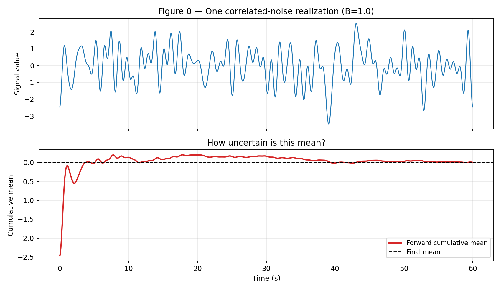

The lower panel is the forward cumulative average. It drifts, then slowly settles. The central question is: how uncertain is the final mean from one finite, correlated realization?

This article addresses that question using batch-means estimators and the method of Mockett, Thiele, and Knacke [1]. We also place this approach in context with other families such as PyMBAR-style statistical inefficiency methods [2] and Heidelberger-Welch diagnostics [3].

---

## 2) Why $\sigma/\sqrt{n}$ fails for correlated signals

i.i.d. means independent and identically distributed samples.

For i.i.d. data, the standard uncertainty of the sample mean is
\[
\mathrm{Std}(\bar X) = \frac{\sigma}{\sqrt{n}}. \tag{1}
\]

For correlated signals, nearby samples are not independent, so the effective number of independent observations is smaller. A better model is:
\[
\mathrm{Std}(\bar X) \approx \frac{\sigma}{\sqrt{n_{\mathrm{eff}}}},
\qquad n_{\mathrm{eff}} < n. \tag{2}
\]

### Figure 1 — Effective sample size intuition

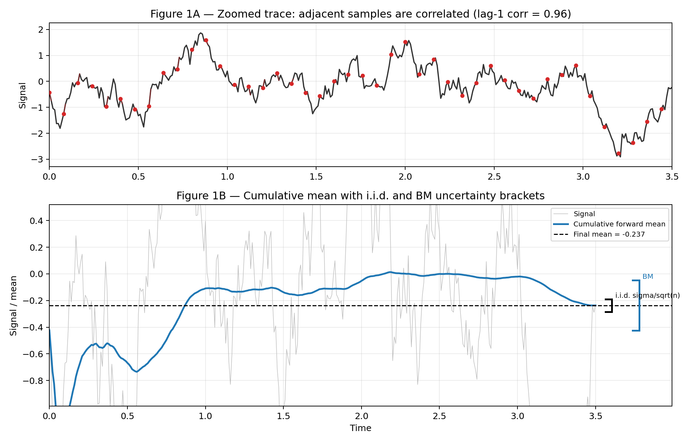

Intuitively, the BM method looks like a better estimate of the uncertainty in the mean, while the $\sigma/\sqrt{n}$ estimate looks like it underestimates that uncertainty.

---

## 3) Batch means and ergodicity

The batch-means idea is:
1. split one long signal into batches,
2. compute batch means,
3. use variance of those batch means as an estimate of uncertainty in the mean at that time scale,
4. use the Mockett idea: fit/interpolate the batch-means trend versus averaging time and evaluate that model at the full signal length.

This relies on an ergodicity assumption: time averages from one sufficiently long realization are representative of ensemble statistics.

It is also possible to use batch means directly (without interpolation), but only when the batch means are approximately uncorrelated and enough batches remain to estimate variance stably. In practice, that requires extra checks (for example, batch-mean autocorrelation and sensitivity to batch length), or a defensible batch-length choice.

### Figure 2 — Ergodic batching on a transient signal

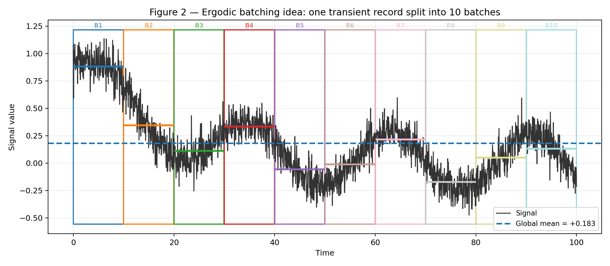

### Figure 4 — Batch means scaling and extrapolation

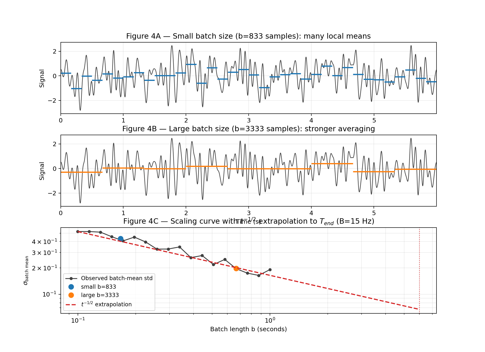

Why $t^{-1/2}$ scaling? For band-limited white noise, the exact normalized mean-variance model is
\[
\mathrm{var\_mean\_bl}(t,B)
= \frac{-\sin^2(\pi B t) + \pi B t \,\mathrm{Si}(2 \pi B t)}{(\pi B t)^2}. \tag{3}
\]
So the uncertainty ratio is
\[
\frac{\sigma_{\mathrm{mean}}}{\sigma_{\mathrm{signal}}}
= \sqrt{\mathrm{var\_mean\_bl}(t,B)}. \tag{4}
\]
At long averaging times, this asymptotes as
\[
\frac{\sigma_{\mathrm{mean}}}{\sigma_{\mathrm{signal}}} \propto t^{-1/2}
\quad \text{for large } t. \tag{5}
\]

### Figure 5 — How σ_mean/σ_signal changes with bandwidth B

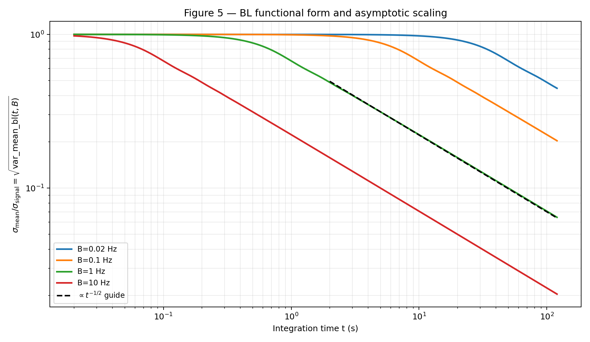

### Figure 6 — Raw signals across bandwidth regimes

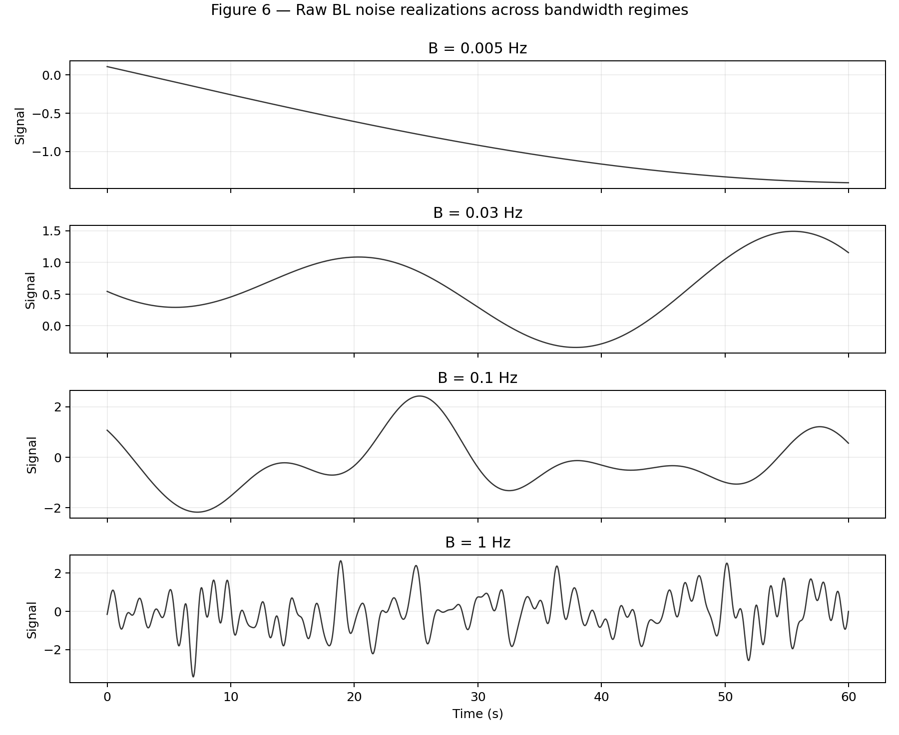

These raw traces make the physical mechanism clear: lower-frequency modes persist longer in time and therefore dominate uncertainty in the mean over practical averaging windows.

---

## 4) Fitting methods for batch-means curves

For each window, we build points \((b_i, v_i)\), where \(b_i\) is batch length and \(v_i\) is the observed batch-mean variance at that length.

The primary fit used in this repository is the full BL functional-form fit:
\[
\hat B
= \arg\min_B \sum_i
\left[
\log\!\left(\frac{v_i}{\sigma^2_{\mathrm{window}}}\right)
- \log\!\left(\mathrm{var\_mean\_bl}(b_i, B)\right)
\right]^2. \tag{6}
\]
Then the mean-uncertainty prediction at signal length \(T\) is
\[
\widehat{\mathrm{Var}}(\bar X_T)
= \mathrm{var\_mean\_bl}(T,\hat B)\,\sigma^2_{\mathrm{window}}. \tag{7}
\]

Alternative fitting/extrapolation ideas that are useful for comparison:
- Tail power-law fit, using \(\sigma_{\mathrm{mean}} \propto t^{-1/2}\) on the longest-time points.
- Conservative Mockett-style extrapolation, using the most conservative admissible bandwidth trend from the batch-mean scaling curve.

Expected regime behavior:
- Underresolved \(B\): weak curvature, fit is most sensitive and can underpredict.
- Mid/resolved \(B\): strongest curvature leverage, fit is most reliable.
- Highly overresolved \(B\): curve is close to asymptotic scaling and methods tend to agree.

### Figure 7 — Example of three fitting approaches on one batch-means curve

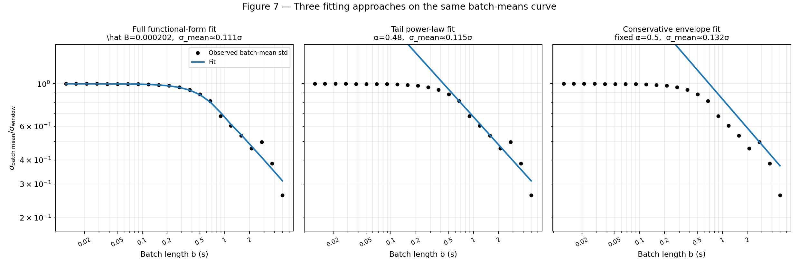

### Figure 8 — Expected fit behavior across B regimes

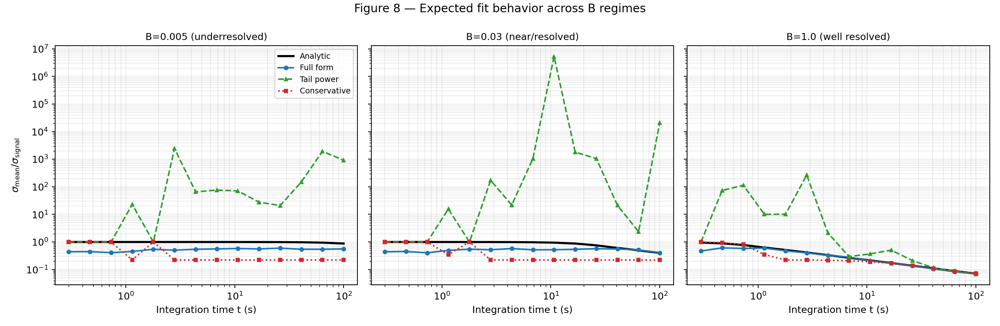

For the remainder of this article, we use the full functional-form fit method.

---

## 5) Overlapping batch means (OBM)

Overlapping batch means (OBM) reuses samples between consecutive batches to reduce estimator noise at a given batch length. This approach is classically discussed by Meketon and Schmeiser [4].

### Figure 3 — What overlap means geometrically

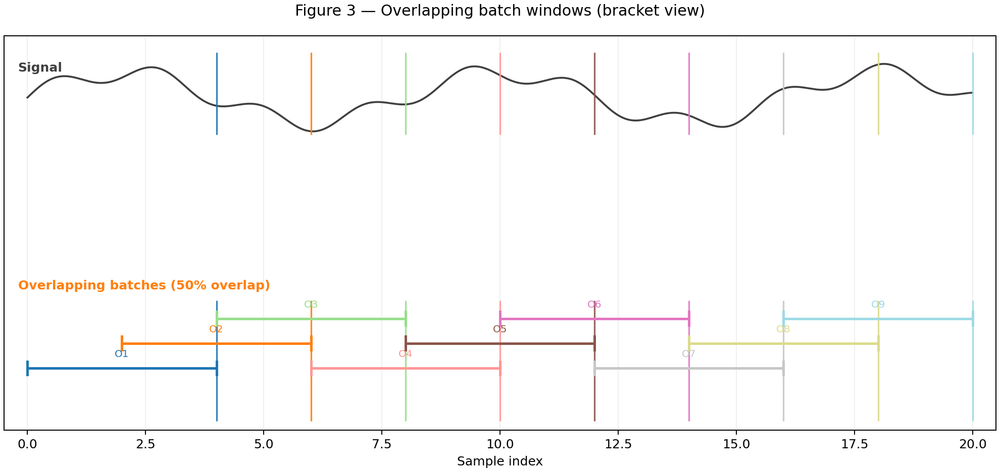

---

## 6) BM performance across bandwidth regimes

Generation details for Figures 14 and 10:
- Signals are generated using the artificial band-limited noise generator (`generate_bl_noise`) from this repository.
- Each bandwidth case uses 20 independent synthetic signals.
- Evaluation windows are sampled over integration times from 0.2 s to 100 s.
- BM estimates are compared against the analytic BL target.

### Figure 14 — BM behavior over the full regime range

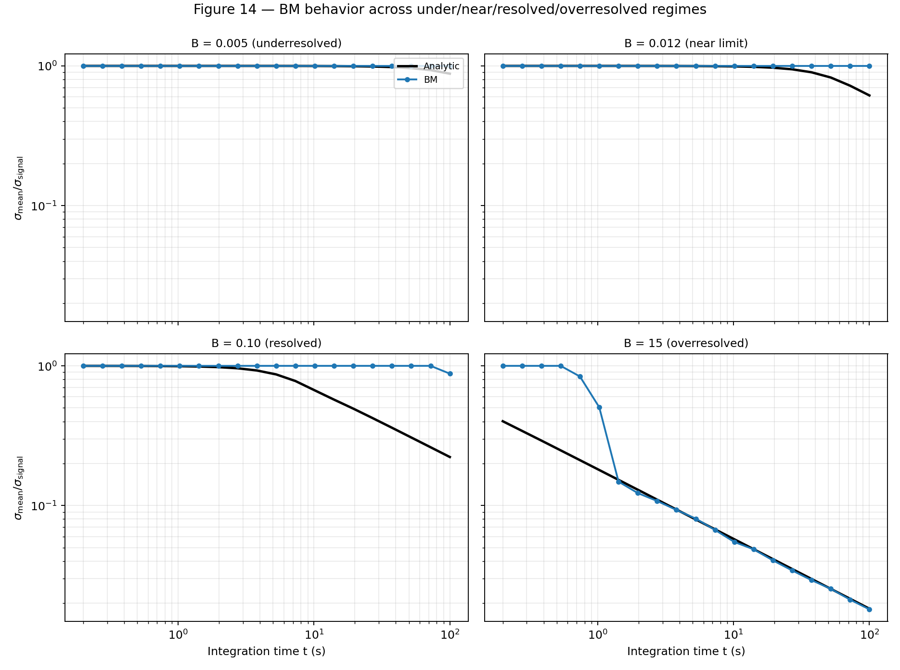

### Figure 10 — BM-only performance vs B

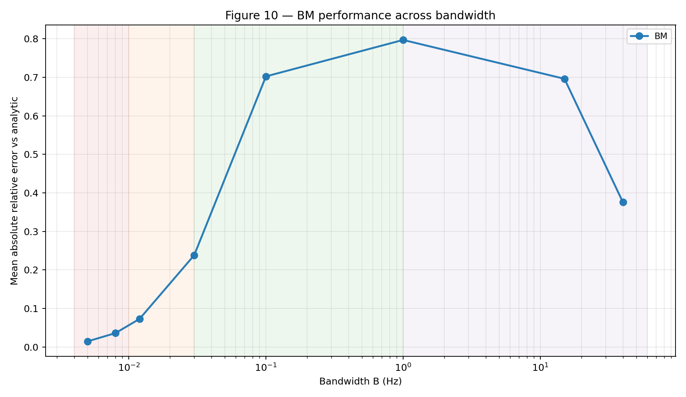

At lower integration times, when the standard deviation and low-frequency modes are not yet well resolved, BM can underpredict the standard deviation of the mean.

---

## 7) OBM overlap-ratio effects

To isolate the overlap effect, this section compares OBM with overlap ratios 0.01, 0.1, 0.25, 0.5, and 0.75.

Generation details for Figures 16 and 15:
- Signals are generated using the artificial band-limited noise generator (`generate_bl_noise`) from this repository.
- Each bandwidth case uses 20 independent synthetic signals.
- Evaluation windows are sampled over integration times from 0.2 s to 100 s.
- OBM estimates (for each overlap ratio) are compared against the analytic BL target.

### Figure 16 — OBM behavior over the full regime range (overlap sweep)

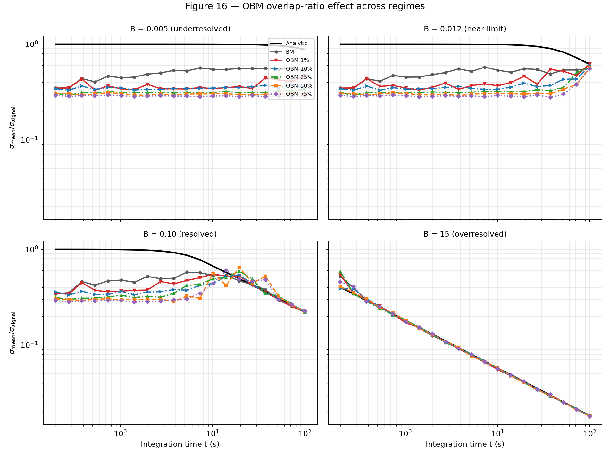

### Figure 15 — OBM performance vs B (overlap sweep)

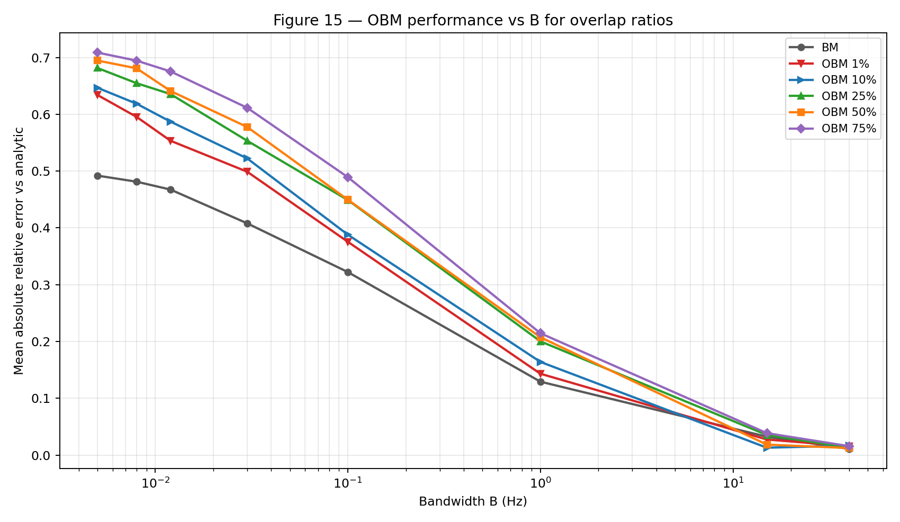

These two figures let the reader compare BM first, then see the OBM change over time and bandwidth as overlap increases.

---

## 8) References

[1] Mockett, C., Thiele, F., Knacke, T., and Stroh, A. (2010). *Detection of Initial Transients and Estimation of Statistical Error in Time-Resolved Turbulent Flow Data*. Proceedings of the 8th International Symposium on Engineering Turbulence Modelling and Measurements (ETMM8), Marseille, France, June 9-11, 2010.

[2] Chodera, J. D., Swope, W. C., Pitera, J. W., Seok, C., and Dill, K. A. (2007). *Use of the weighted histogram analysis method for the analysis of simulated and parallel tempering simulations*. Journal of Chemical Theory and Computation, 3(1), 26-41.

[3] Heidelberger, P., and Welch, P. D. (1983). *Simulation run length control in the presence of an initial transient*. Operations Research, 31(6), 1109-1144.

[4] Meketon, M. S., and Schmeiser, B. W. (1984). *Overlapping Batch Means: Something for Nothing?* Proceedings of the Winter Simulation Conference.
